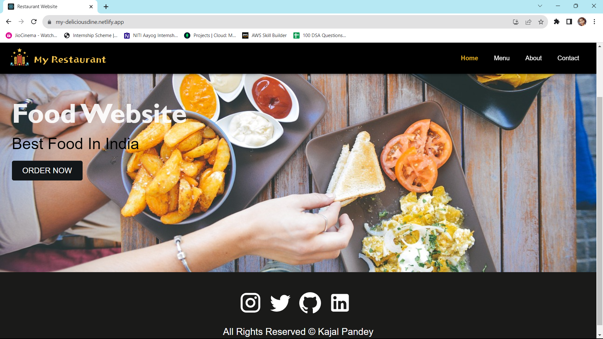
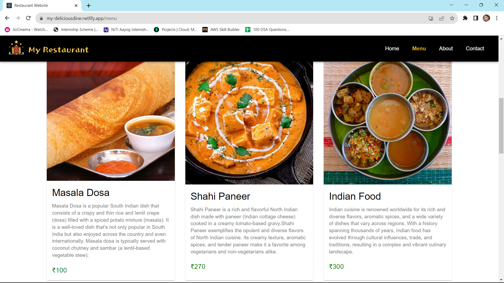
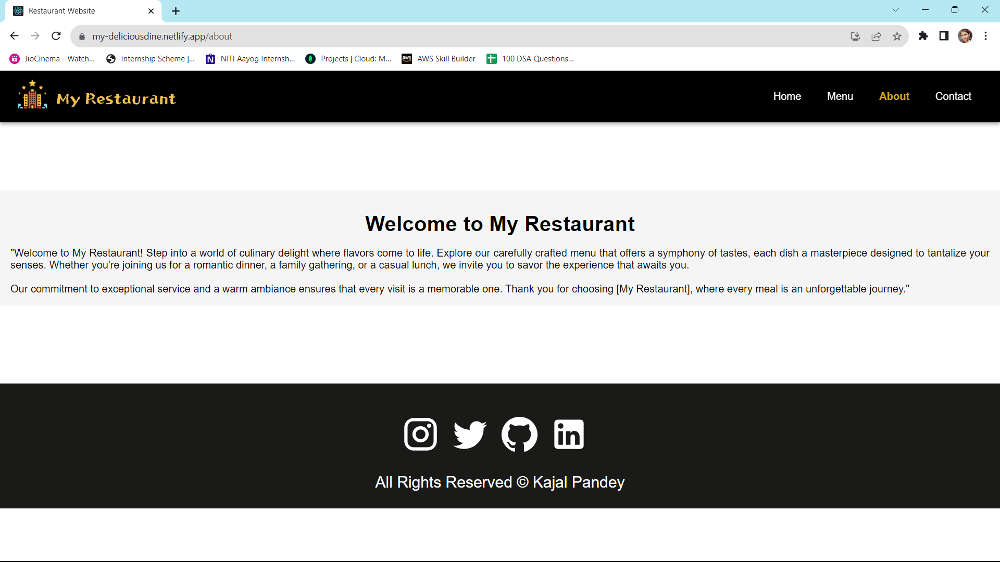
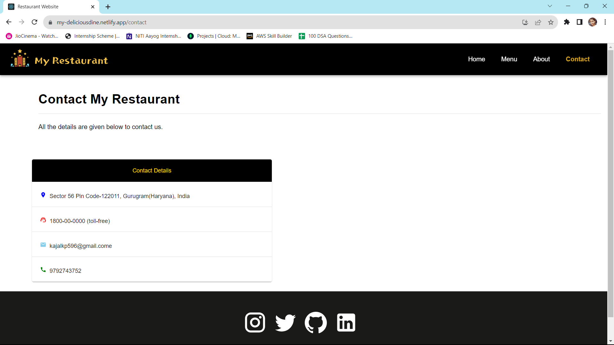

# Restaurant-Website

This is a Restaurant Website built using React and Material-UI (MUI). The code consists of components for different pages of the website, including Home, About, Menu, Contact, and a Header for navigation. The website is styled using MUI's styling system and responsive design techniques.
Let me provide you with a description of each component:

# 1. Home Component (Home.js):
This component represents the home page of the restaurant website. It displays a banner image with the restaurant name and a call-to-action button to order food. The content is wrapped in a Layout component for consistent styling.

# 2. About Component (About.js):
The About page provides information about the restaurant. It contains a title, a brief welcome message, and a description of the restaurant's offerings. The content is centered, and the styling adjusts based on screen size using media queries.

# 3. Menu Component (Menu.js):
The Menu page displays a list of menu items fetched from the MenuList data. Each menu item is presented in a styled card with an image, name, description, and price. The Layout component provides the consistent layout structure.

# 4. Contact Component (Contact.js):
The Contact page provides details for contacting the restaurant. It includes the restaurant's address, toll-free phone number, email address, and a mobile number. The contact details are displayed in a table format for organized presentation.

# Header Component (Header.js):
The Header component creates a navigation bar for the website. It includes a logo, navigation links (Home, Menu, About, Contact), and a responsive mobile menu (hamburger icon). The navigation links are styled as a list and change appearance when active.

## Screenshots

# Deployment link:
https://my-deliciousdine.netlify.app/

## Connect with Us

Let's connect on LinkedIn:

- [Kajal Pandey 🙎‍♀️](https://www.linkedin.com/in/kajal-pandey-08b312260/)
